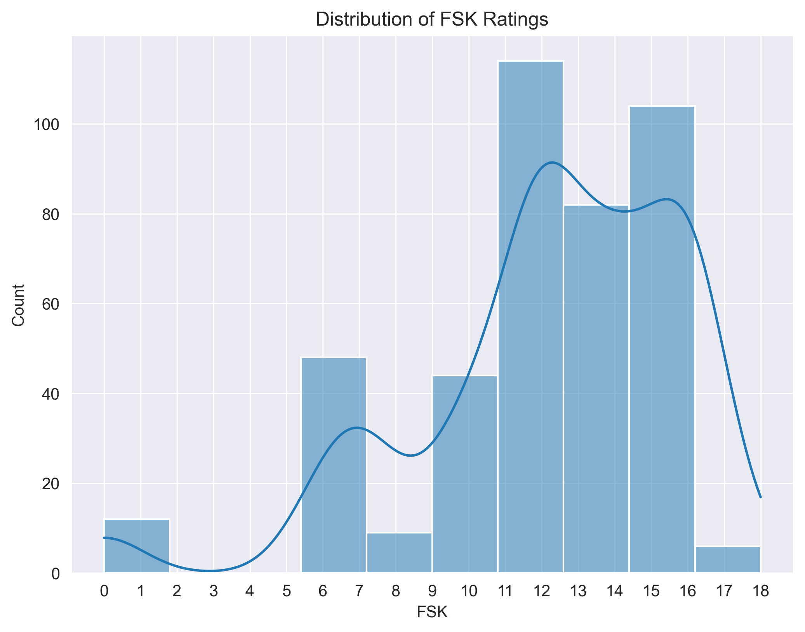
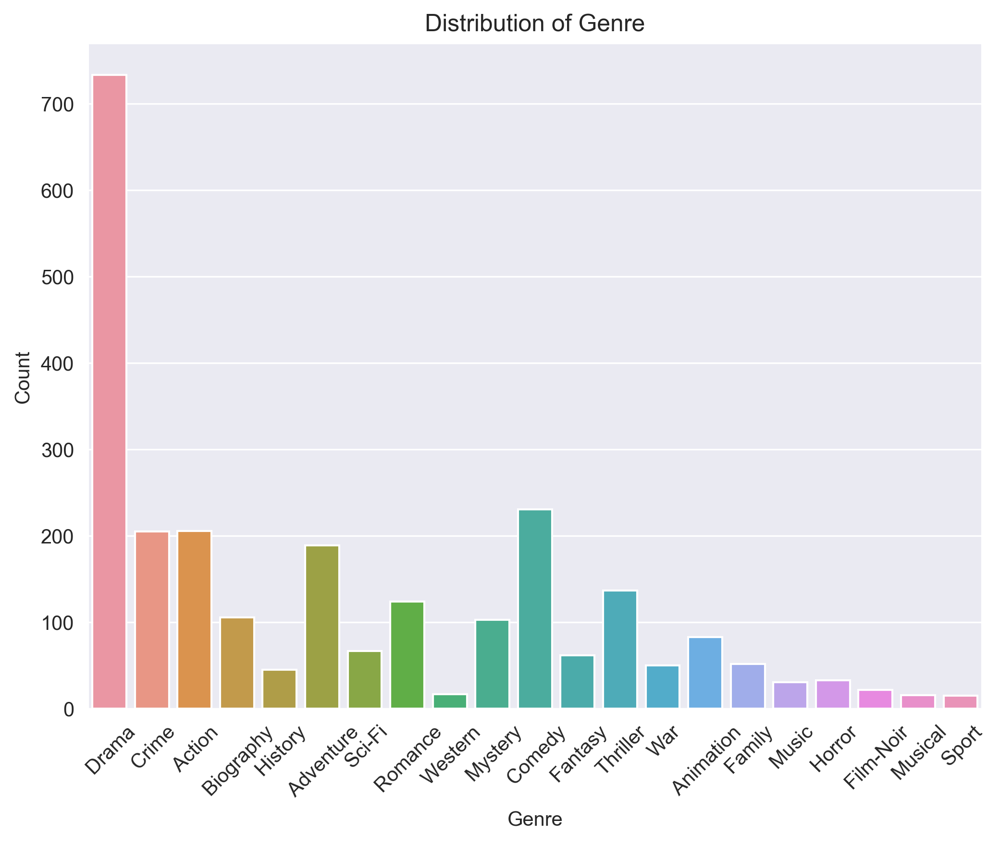
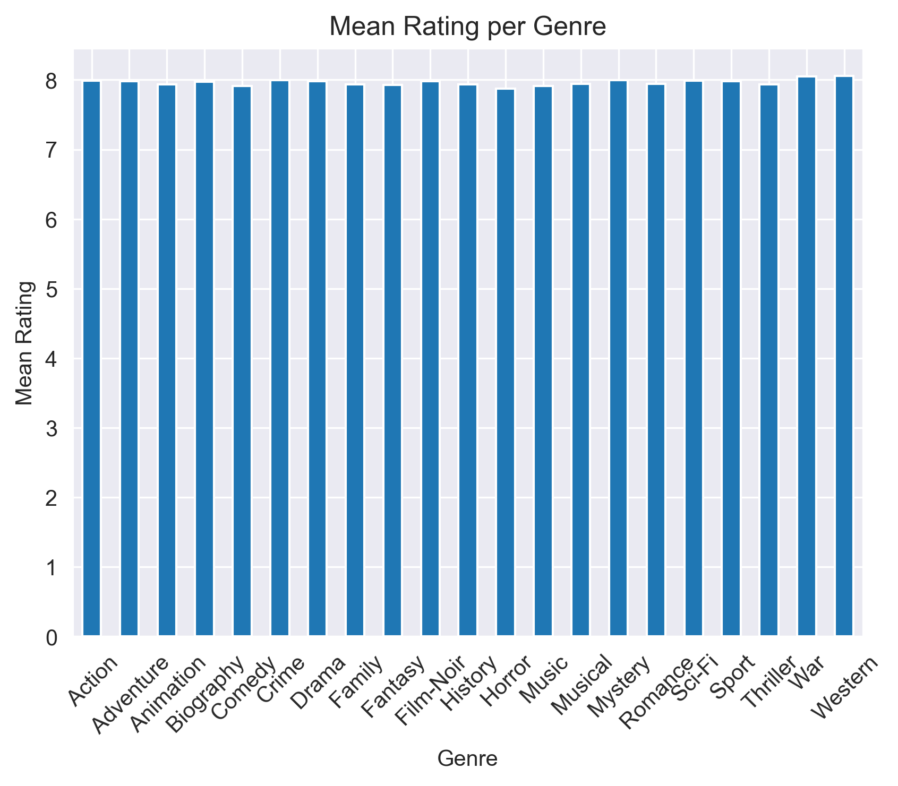
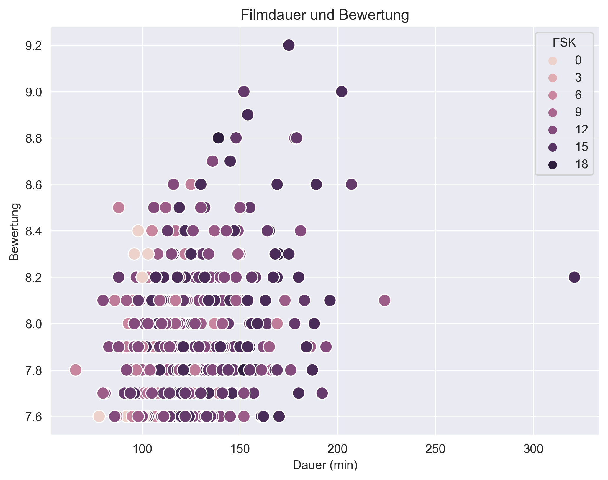
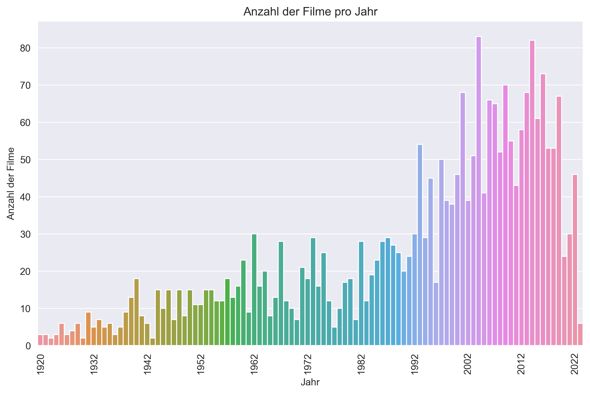
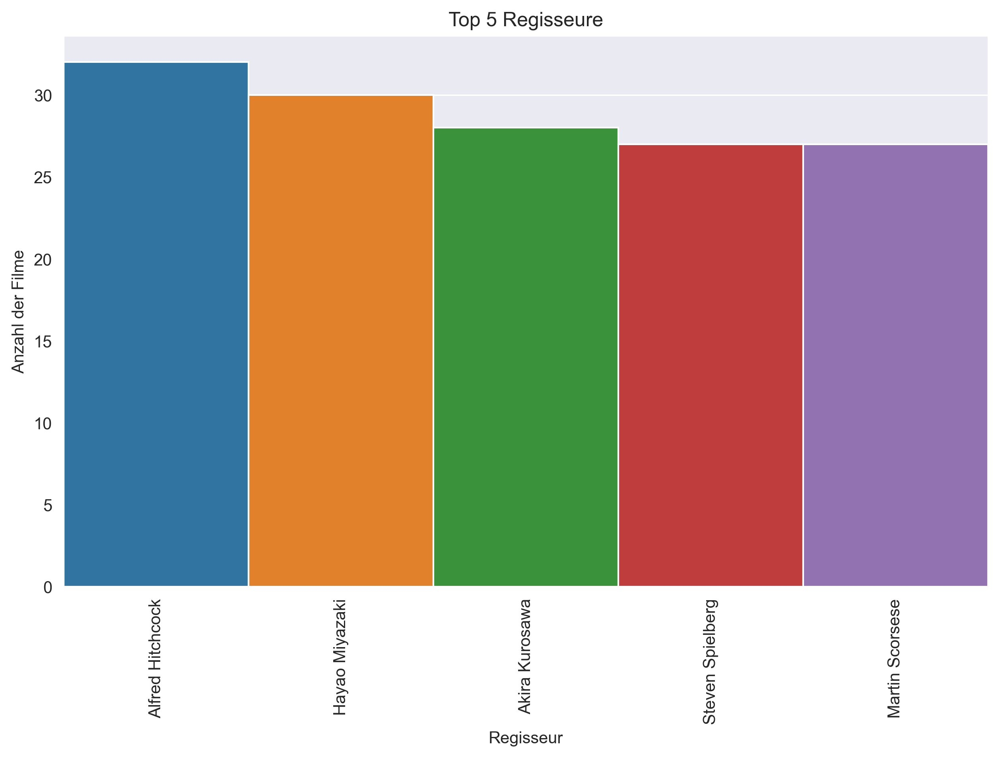
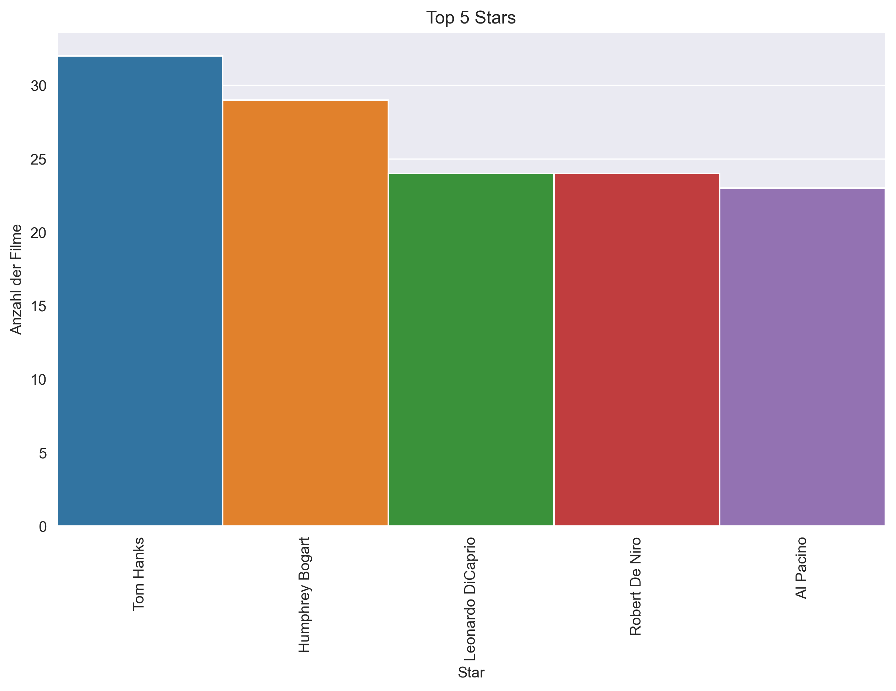

# Bericht zur Mini-Challenge - Extraktion von IMDB-Daten
Dieser Bericht beschreibt die Hauptideen und die Umsetzung der Mini-Challenge zur Extraktion von IMDB-Daten mithilfe von
Python und Selenium. Die Implementierung verwendet XPath, um auf die relevanten Elemente der IMDB-Website zuzugreifen 
und die Daten zu extrahieren.

## Beschreibung der Idee
Die Hauptidee dieser Mini-Challenge besteht darin, Daten von der IMDB-Website zu extrahieren, insbesondere aus dem 
Bereich der am besten bewerteten Filme. Die Website bietet eine Liste von 1.000 Filmen, die nach der Bewertung der 
Nutzer sortiert sind. Wir möchten Informationen wie Filmtitel, Erscheinungsjahr, Laufzeit, Genre, Bewertung, Regisseure,
Stars und FSK extrahieren.

Die Implementierung erfolgt mithilfe von Python und Selenium. Selenium ermöglicht es uns, die IMDB-Website zu öffnen, 
auf Elemente zuzugreifen und die benötigten Daten zu extrahieren.

## Datenwissentschaftlicher Aspekt
In diesem Abschnitt werden die visualisierten Daten präsentiert und erläutert.

Abbildung 1: Die Verteilung der FSK-Bewertungen zeigt, dass die Mehrheit der Filme eine FSK von über 12 Jahren haben. 
Aber dies kann leider nicht genau bestätigt werden da einige Filme keine Angabe zu der FSK hatten und dementsprechend 
die Daten dazu fehlen.

Abbildung 2: Es ist deutlich zu sehen, dass über 700 der top 1000 Filmen das Genre Drama besitzen. 
Wichtig zu wissen ist das mehrere Filme auch mehrere Genres besitzen.

Abbildung 3: Die Analyse des durchschnittlichen Ratings (Mean Rating) pro Genre zeigt, dass alle Genres ähnliche Werte 
aufweisen, die um 8 liegen. Dies deutet darauf hin, dass die Qualität der Filme in allen Genres ähnlich ist und die 
Zuschauer in der Regel die Top-Filme unabhängig vom Genre positiv bewerten. Es ist wichtig zu beachten, dass diese 
Analyse auf den am besten bewerteten Filmen basiert, und es kann Unterschiede im durchschnittlichen Rating zwischen den 
Genres geben, wenn man den gesamten Filmkatalog betrachtet. Dennoch zeigt der Plot, dass es eine hohe Qualität von 
Filmen über alle Genres hinweg gibt, die von den Zuschauern geschätzt wird.

Abbildung 4: Der Zusammenhang zwischen Filmdauer und Bewertung zeigt, dass die Dauer der Filme keine grosse Wirkung auf 
die Bewertung haben. Was deutlich zu sehen ist das ein Film über 300min ein Ausreisser ist.

Abbildung 5: Der Plot zur Anzahl der Filme pro Jahr zeigt einen deutlichen Anstieg der Filmproduktion ab dem Jahr 1992. 
Dies könnte auf eine Vielzahl von Faktoren zurückzuführen sein, wie zum Beispiel die Weiterentwicklung der 
Filmtechnologie, die zunehmende Globalisierung der Filmindustrie oder Veränderungen im Zuschauerverhalten.

Abbildung 6: Der Plot der Top 5 Regisseure zeigt diejenigen Filmemacher, deren Werke am häufigsten in den Top 1000 
Filmen vertreten sind. Interessanterweise weist keiner der fünf Regisseure eine deutlich höhere Anzahl von Filmen in 
dieser Liste auf, was darauf hindeutet, dass die künstlerische Qualität und der Erfolg ihrer Filme eher gleichmäßig 
verteilt sind.

Abbildung 7: Der Plot der Top 5 Stars veranschaulicht, welche Schauspieler am häufigsten in den Top 1000 Filmen 
vertreten sind. Auffallend ist, dass keiner der fünf Stars einen deutlich höheren Anteil an Filmen in dieser Liste 
aufweist, was auf eine gewisse Gleichverteilung der Präsenz dieser Schauspieler in erfolgreichen Filmen hindeutet.

## Relevanz für die reale Welt
Die Filmindustrie ist eine bedeutende Branche mit komplexen Faktoren, die die Filmproduktion, das Marketing und die 
Vorlieben des Publikums beeinflussen. Die Extraktion und Analyse von Daten von IMDB liefert wertvolle Erkenntnisse über 
diese Faktoren und könnte Filmstudios und Vermarktern helfen, datengesteuerte Entscheidungen zu treffen.

Die Ergebnisse dieser Mini-Challenge sind in der realen Welt relevant, da sie der Filmindustrie nützliche Informationen 
liefern könnten. Die Analyse der IMDB-Daten kann beispielsweise Marketingstrategien für Filmstudios aufzeigen, ihnen 
helfen, ihr Publikum gezielt anzusprechen, und die Produktionsentscheidungen für zukünftige Filme verbessern.

## Originalität
Obwohl Web Scraping und Datenanalyse gängige Aufgaben in der Datenwissenschaft sind, ist diese spezifische 
Mini-Challenge einzigartig, da sie sich auf die IMDB-Website und ihre spezifischen Daten konzentriert. Die Analyse 
dieser Daten ermöglicht es uns, Trends in der Filmindustrie zu erkennen, Muster in den Benutzerpräferenzen zu 
identifizieren und wertvolle Erkenntnisse über die Faktoren zu gewinnen, die zum Erfolg oder Misserfolg eines Films 
beitragen.

Die Originalität dieser Mini-Challenge liegt auch in der Verwendung von Selenium und XPath, um auf die IMDB-Website 
zuzugreifen und die Daten zu extrahieren. Dieser Ansatz bietet Flexibilität und Skalierbarkeit, um verschiedene Elemente 
der Website effektiv zu erfassen.

## Nützlichkeit:
Daten von IMDB und die gewonnenen Erkenntnisse aus ihrer Analyse sind in verschiedenen realen Szenarien nützlich. 
Filmstudios können diese Daten nutzen, um ihre Produktionsentscheidungen zu verbessern, datengesteuerte 
Marketingentscheidungen zu treffen und ihre Zielgruppenstrategien zu optimieren.

Durch die Analyse der IMDB-Daten können Filmstudios Einblicke in die Vorlieben des Publikums gewinnen und Trends in der 
Filmindustrie identifizieren. Diese Informationen können bei der Entwicklung von zukünftigen Filmprojekten helfen, indem
sie auf die Bedürfnisse und Präferenzen der Zuschauer eingehen. Marketingentscheidungen können ebenfalls auf den 
gewonnenen Erkenntnissen basieren, um gezielte Werbekampagnen zu entwickeln und das Publikum effektiv anzusprechen.

Darüber hinaus können die Daten und Erkenntnisse aus der IMDB-Analyse auch für die Entwicklung präziserer 
Filmempfehlungssysteme verwendet werden. Durch die Nutzung der Informationen über Genre, Bewertungen und andere 
Eigenschaften der Filme können personalisierte Empfehlungen für die Zuschauer erstellt werden, um deren Seherlebnis zu 
verbessern.

Insgesamt ist die Extraktion und Analyse von Daten aus IMDB mithilfe von Selenium und XPath eine wertvolle Übung für 
die Datenanalyse in der Filmindustrie. Die erworbenen Kenntnisse und Fähigkeiten sind auf andere Web-Scraping-Aufgaben 
übertragbar und können in verschiedenen realen Szenarien angewendet werden.

## Kenntnis des Skripts und des Zugriffs (HTML, XPath, Regex, etc.)
Das vorliegende Skript ist in Python geschrieben und verwendet die Selenium-Bibliothek, um auf die IMDB-Website 
zuzugreifen und die gewünschten Daten zu extrahieren. XPath wird verwendet, um spezifische HTML-Elemente zu 
identifizieren und auf sie zuzugreifen.

Die Hauptfunktionen des Skripts sind:

1. Identifizierung der Schaltfläche "Next »" zum Wechseln zur nächsten Seite der Filmliste.
2. Extraktion der Informationen zu jedem Film, einschließlich Rang, Filmtitel, Erscheinungsjahr, Laufzeit, Genre, 
   Bewertung, FSK, Regisseur und Stars.
3. Verarbeitung der extrahierten Informationen und Speicherung in den entsprechenden Listen.

XPath wird verwendet, um die HTML-Elemente zu finden, die die gewünschten Informationen enthalten. Die XPath-Ausdrücke 
werden verwendet, um die Struktur und die Klassenattribute der Elemente zu beschreiben, auf die zugegriffen werden soll.

Die Verwendung von XPath ermöglicht eine präzise und flexible Identifizierung der relevanten Elemente auf der 
IMDB-Website. Dadurch können die Daten effizient extrahiert werden.

Das Skript demonstriert ein gutes Verständnis des Ziels und des Zugriffs auf die IMDB-Website mithilfe von XPath. 
Es nutzt die spezifischen HTML-Strukturen und Klassenattribute, um die erforderlichen Daten zu extrahieren.